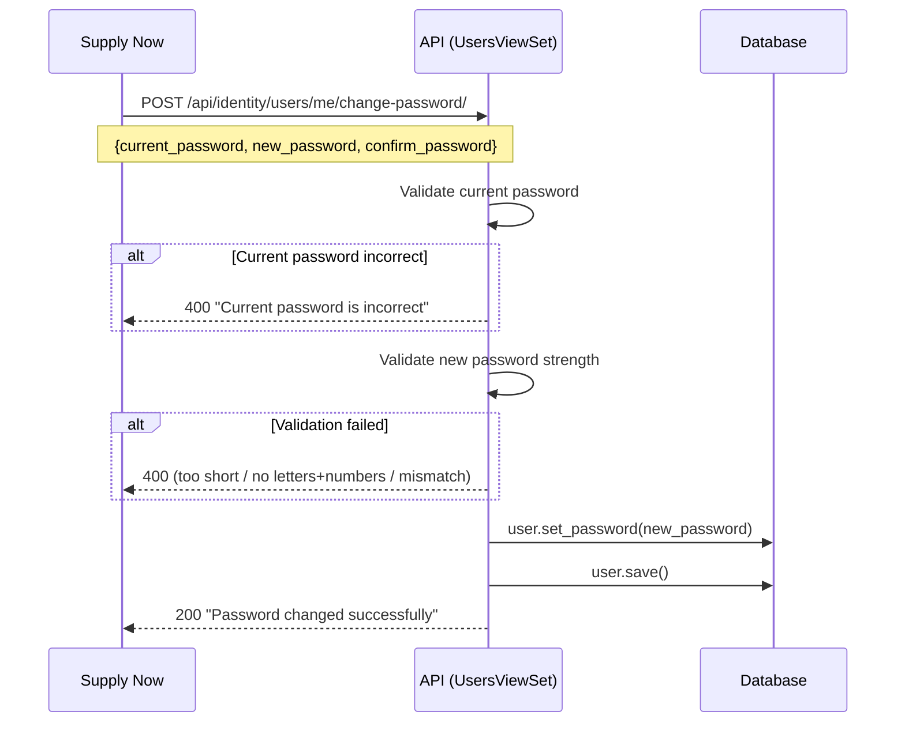

# Change Password — Technical Documentation

**Created:** 2026-02-16
**Last Updated:** 2026-02-16

## Overview

Allows authenticated users to change their own password via the API. Validates current password, enforces strength requirements, and updates the password in the database.

## Architecture

### Flow Diagram



## API Endpoint

### POST `/api/identity/users/me/change-password/`

Change the current user's password.

**Authentication:** Required (Token)

**Request:**
```json
{
    "current_password": "oldPass123",
    "new_password": "newSecure456",
    "confirm_password": "newSecure456"
}
```

**Response (200):**
```json
{
    "message": "Password changed successfully"
}
```

**Errors:**

| Code | Error | Condition |
|------|-------|-----------|
| 400 | `Current password is incorrect` | `check_password()` returns False |
| 400 | `Password must be at least 8 characters` | `len(new_password) < 8` |
| 400 | `Passwords do not match` | `new_password != confirm_password` |
| 400 | `Password must contain letters and numbers` | Missing alpha or digit chars |

## Key Files

| File | What |
|------|------|
| `app/identity/views.py` | `UsersViewSet.change_password()` action |
| `mobile/.../providers/user_provider.dart` | `UserNotifier.changePassword()` |
| `mobile/.../view/profile_screen.dart` | `_showChangePasswordDialog()` UI |

## Validation Rules

Server-side validation (in order):

1. **Current password check** — `user.check_password(current_password)`
2. **Minimum length** — at least 8 characters
3. **Confirmation match** — `new_password == confirm_password`
4. **Strength** — must contain at least one letter AND one digit

Client-side validation in Flutter mirrors the same rules for immediate feedback.

## Permissions & Access Control

| Role | Can Change Own Password |
|------|------------------------|
| Any authenticated user | Yes |

No admin override — users can only change their own password via this endpoint.

## Known Limitations

- Does not invalidate existing sessions/tokens after password change
- Does not use Django's built-in password validators (`AUTH_PASSWORD_VALIDATORS`) — uses custom inline validation
- No password history check (user can reuse old passwords)
