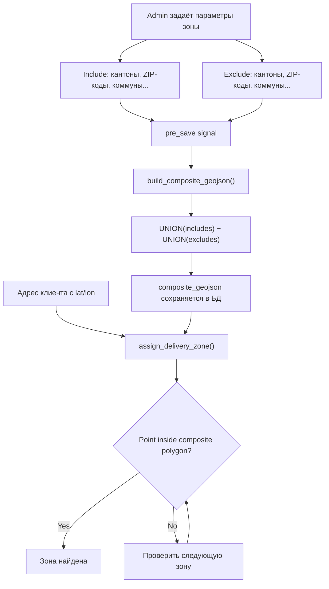

# Delivery Zones — Technical Documentation

**Created:** 2026-02-21
**Last Updated:** 2026-02-21

## Overview

Система Delivery Zones определяет географические зоны доставки для каждого поставщика (Supplier). Зоны используются для автоматического назначения адресов клиентов в соответствующие зоны доставки на основе координат (lat/lon).

Ключевая особенность — **pre-computed polygons**: вместо проверки отдельных административных полей (кантон, ZIP) система заранее строит итоговый полигон зоны из реальных географических границ swisstopo и проверяет принадлежность точки полигону (point-in-polygon).

### Architecture Flow



## Concept: Include / Exclude

Каждая зона описывается двумя группами параметров:

### Include (Объединение)

Что **входит** в зону. Все указанные границы объединяются (UNION):

| Параметр | Пример | Описание |
|----------|--------|----------|
| Country | `CH` | Страна. Один код |
| Cantons | `GE` или `GE,VD` | Кантоны через запятую (коды) |
| Districts | `Sion,Martigny` | Округа через запятую |
| Communes | `Ayent,Arbaz` | Коммуны (муниципалитеты) через запятую |
| ZIP codes | `1298,1897` | Почтовые индексы через запятую |
| Polygon GeoJSON | `{...}` | Ручной GeoJSON полигон (Polygon/MultiPolygon) |

### Exclude (Исключение)

Что **вычитается** из зоны. Все исключения объединяются и вычитаются из Include:

| Параметр | Пример | Описание |
|----------|--------|----------|
| Exclude Cantons | `GE` | Кантоны для исключения |
| Exclude Districts | `Aigle` | Округа для исключения |
| Exclude Communes | `céligny` | Коммуны для исключения |
| Exclude ZIP codes | `1298` | Почтовые индексы для исключения |
| Exclude Polygon | `{...}` | Ручной GeoJSON полигон для вырезания |

### Формула

```
composite_geojson = UNION(Country, Cantons, Districts, Communes, ZIP codes, Polygon)
                  − UNION(Excl. Cantons, Excl. Districts, Excl. Communes, Excl. ZIP codes, Excl. Polygon)
```

## Practical Examples

### Example 1: Geneva (кантон GE без анклава Céligny)

Céligny (ZIP 1298) — коммуна кантона GE, но географически окружена кантоном VD. Логистически удобнее доставлять из Lausanne.

| Параметр | Значение |
|----------|----------|
| **Include: Canton** | `GE` |
| **Exclude: ZIP** | `1298` |
| **Exclude: Commune** | `céligny` |

**Результат:** Полигон кантона Женева без территории Céligny.

### Example 2: Lausanne (кантон VD + Céligny + Le Bouveret)

Зона Vaud с добавлением двух точек из других кантонов, которые логистически ближе.

| Параметр | Значение |
|----------|----------|
| **Include: Canton** | `VD` |
| **Include: ZIP** | `1298,1897` |

**Результат:** Полигон кантона Vaud + территория ZIP 1298 (Céligny) + территория ZIP 1897 (Le Bouveret).

### Example 3: Switzerland (вся страна кроме GE и VD)

Зона для всех остальных кантонов — то, что не покрывают зоны Geneva и Lausanne.

| Параметр | Значение |
|----------|----------|
| **Include: Country** | `CH` |
| **Exclude: Cantons** | `GE,VD` |

**Результат:** Полигон всей Швейцарии минус Женева и Во.

### Visual Representation

```
┌──────────────────────────────────────────────────────────┐
│                    Switzerland (CH)                        │
│                                                           │
│   ┌──────────┐                                            │
│   │  Geneva   │  ○ Céligny (1298)                         │
│   │   (GE)    │     ↓ excluded from GE                    │
│   │           │     ↓ included in VD zone                 │
│   └──────────┘                                            │
│              ┌──────────────┐                              │
│              │  Lausanne     │                              │
│              │   (VD)        │                              │
│              │  + ZIP 1298   │                              │
│              │  + ZIP 1897   │                              │
│              └──────────────┘                              │
│                                                           │
│           All other cantons = "Switzerland" zone            │
│           (CH minus GE,VD)                                 │
└──────────────────────────────────────────────────────────┘
```

## How composite_geojson Is Built

### Data Sources

Границы берутся из локальных JSON-файлов swisstopo (swissBOUNDARIES3D):

| Файл | Содержимое | Кол-во записей |
|------|------------|----------------|
| `app/data/geography/ch/cantons.json` | 26 кантонов CH | ~22 MB |
| `app/data/geography/ch/districts.json` | ~134 округа | ~47 MB |
| `app/data/geography/ch/communes.json` | ~2 147 коммун | ~153 MB |
| `app/data/geography/ch/plz.json` | ~3 194 почтовых индекса | ~154 MB |

Для стран кроме CH — fallback на Nominatim API (OpenStreetMap).

### Build Algorithm

```python
# 1. Собрать INCLUDE features
include_features = []
include_features += get_canton_boundary(canton) for canton in zone.cantons
include_features += get_plz_boundary(plz) for plz in zone.zip_codes
include_features += get_commune_boundary(commune) for commune in zone.communes
# ... districts, polygon_geojson

# 2. Собрать EXCLUDE features
exclude_features = []
exclude_features += get_canton_boundary(canton) for canton in zone.exclude_cantons
exclude_features += get_plz_boundary(plz) for plz in zone.exclude_zip_codes
# ... etc.

# 3. Применить исключения
if not exclude_features:
    return FeatureCollection(include_features)  # Simple case
else:
    include_union = unary_union([shape(f['geometry']) for f in include_features])
    exclude_union = unary_union([shape(f['geometry']) for f in exclude_features])
    result = include_union.difference(exclude_union)  # Shapely geometry difference
    return FeatureCollection([Feature(geometry=mapping(result))])
```

### Auto-Rebuild Trigger

Composite пересчитывается **автоматически** через Django `pre_save` signal при изменении любого из географических полей:

```
country, cantons, districts, cities, communes, zip_codes, polygon_geojson,
exclude_cantons, exclude_districts, exclude_cities, exclude_communes,
exclude_zip_codes, exclude_polygon_geojson
```

Не нужно вручную пересчитывать — достаточно изменить параметры зоны и сохранить.

## How Zone Assignment Works

### Assignment Algorithm

```python
def assign_delivery_zone(address, supplier):
    # 1. Нужны координаты
    if not address.latitude or not address.longitude:
        return None

    # 2. Получить активные зоны (по приоритету)
    zones = DeliveryZone.objects.filter(
        supplier=supplier, is_active=True
    ).order_by('priority', 'id')

    point = Point(address.longitude, address.latitude)

    for zone in zones:
        # 3a. composite_geojson — АВТОРИТЕТНЫЙ источник
        if zone.composite_geojson:
            if point_in_composite(point, zone.composite_geojson):
                return zone
            continue  # composite авторитетен — fallback не нужен

        # 3b. Fallback: ручной полигон
        if zone.polygon_geojson:
            if point_in_polygon(point, zone.polygon_geojson):
                return zone

        # 3c. Fallback: административное совпадение
        if administrative_match(address, zone):
            return zone

    return None  # Адрес не попадает ни в одну зону
```

### Priority

Зоны проверяются в порядке приоритета (поле `priority`, PositiveIntegerField):

- **Меньшее значение = выше приоритет** (проверяется первым)
- При одинаковом приоритете — по `id` (порядок создания)
- **Первая подходящая зона побеждает** — дальнейшие зоны не проверяются

Пример: Geneva (priority=10) и Lausanne (priority=10) — обе priority=10, Céligny (1298) исключён из Geneva, поэтому попадёт в Lausanne.

### Fallback Chain

```
composite_geojson (pre-computed polygon)
    ↓ нет composite
polygon_geojson (ручной полигон)
    ↓ нет полигона
administrative_match (country + canton + city + ZIP)
    ↓ нет совпадения
None (адрес без зоны)
```

**Важно:** если у зоны есть `composite_geojson`, используется **только** он. `continue` пропускает все fallback-и. Composite уже содержит всю географию зоны.

## Where Zones Are Used

### 1. Client Address Assignment

Модель `ClientAddressDeliveryZone` связывает адрес клиента с зоной доставки для конкретного поставщика:

```
ClientAddress (N) ←→ DeliveryZone (via ClientAddressDeliveryZone)
                     per Supplier
```

- Один адрес может иметь **разные зоны** для разных поставщиков
- Зона назначается автоматически при сохранении `ClientAddressDeliveryZone`
- Уникальное ограничение: одна зона на пару (address, supplier)

### 2. Order Delivery Zone

При создании/обновлении заказа, если указан `delivery_address` — зона назначается автоматически через `pre_save` signal на `Order`.

### 3. Dispatch Planning

Зоны используются для группировки адресов доставки при планировании маршрутов.

## Admin Interface

### Настройка зон

В Django Admin (`/admin/delivery_scheduling/deliveryzone/`):

**Fieldsets:**

1. **Basic Information** — название, поставщик, приоритет, цвет, активность
2. **Include Boundaries (Union)** — страна, кантоны, округа, коммуны, ZIP-коды
3. **Exclude Boundaries (Subtracted)** — исключения (collapsed by default)
4. **Custom Polygons (Advanced)** — ручные GeoJSON полигоны (collapsed)
5. **Composite GeoJSON (Auto-computed)** — результат автопостроения (readonly)

### Admin Actions

| Action | Описание |
|--------|----------|
| **Rebuild composite GeoJSON** | Пересчитать composite для выбранных зон |
| **Reassign delivery zones for all client addresses** | Пересчитать composite + переназначить зоны для всех адресов клиентов выбранных поставщиков |

### Workflow для Production

1. Изменить параметры зоны (кантоны, ZIP, исключения) → **Save** → composite пересчитается автоматически
2. Если нужно переназначить адреса клиентов → выбрать зоны → **Actions → "Reassign delivery zones"**

## Management Commands

### rebuild_composite_geojson

Пересчитать composite_geojson без переназначения адресов:

```bash
python manage.py rebuild_composite_geojson                    # Все зоны
python manage.py rebuild_composite_geojson --zone-id=1        # Конкретная зона
python manage.py rebuild_composite_geojson --supplier-id=1    # Зоны поставщика
python manage.py rebuild_composite_geojson --dry-run          # Только показать
```

### reassign_delivery_zones

Переназначить зоны для заказов:

```bash
python manage.py reassign_delivery_zones                      # Необработанные заказы
python manage.py reassign_delivery_zones --dry-run             # Preview
python manage.py reassign_delivery_zones --supplier-id=123     # Конкретный поставщик
python manage.py reassign_delivery_zones --force               # Переназначить и существующие
```

## Key Files

| File | What |
|------|------|
| `app/delivery_scheduling/models.py` | `DeliveryZone` model — all fields, helpers |
| `app/delivery_scheduling/geography.py` | `build_composite_geojson()` — polygon builder |
| `app/delivery_scheduling/signals.py` | `pre_save` auto-rebuild trigger |
| `app/delivery_scheduling/utils.py` | `assign_delivery_zone()` — assignment logic |
| `app/delivery_scheduling/admin.py` | Admin UI, actions (rebuild, reassign) |
| `app/actors/models.py` | `ClientAddressDeliveryZone` — address↔zone link |
| `app/data/geography/ch/` | swisstopo boundary data (cantons, districts, communes, PLZ) |
| `app/delivery_scheduling/management/commands/rebuild_composite_geojson.py` | CLI rebuild |
| `app/delivery_scheduling/management/commands/reassign_delivery_zones.py` | CLI reassign |

## DeliveryZone Model — Complete Field Reference

### Core Fields

| Field | Type | Default | Description |
|-------|------|---------|-------------|
| `name` | CharField(100) | required | Zone name (e.g., "Geneva", "Lausanne") |
| `priority` | PositiveIntegerField | 0 | Matching priority (lower = higher) |
| `is_active` | BooleanField | True | Active for assignment |
| `display_color` | CharField(7) | `#0000FF` | Hex color for map visualization |
| `country` | CountryField | null | Zone country code |

### Include Boundaries

| Field | Type | Example |
|-------|------|---------|
| `cantons` | CharField(100) | `"GE,VD"` |
| `districts` | CharField(500) | `"Sion,Martigny"` |
| `communes` | CharField(500) | `"Ayent,Arbaz"` |
| `cities` | CharField(500) | deprecated — use communes |
| `zip_codes` | CharField(500) | `"1298,1897"` |
| `polygon_geojson` | JSONField | GeoJSON Polygon/MultiPolygon |

### Exclude Boundaries

| Field | Type | Example |
|-------|------|---------|
| `exclude_cantons` | CharField(100) | `"GE"` |
| `exclude_districts` | CharField(500) | `"Aigle"` |
| `exclude_communes` | CharField(500) | `"céligny"` |
| `exclude_cities` | CharField(500) | deprecated |
| `exclude_zip_codes` | CharField(500) | `"1298"` |
| `exclude_polygon_geojson` | JSONField | GeoJSON to subtract |

### Auto-Computed

| Field | Type | Description |
|-------|------|-------------|
| `composite_geojson` | JSONField | Auto-built FeatureCollection: `UNION(includes) − UNION(excludes)` |

### Meta

- **Ordering:** `['priority', 'id']`
- **Index:** `('supplier_settings_self_controlled', 'is_active')`

## Known Limitations

- **Districts and communes not in Address model** — administrative match fallback does not check districts or communes (fields not yet added to ClientAddress)
- **cities field deprecated** — use communes instead (cities used Nominatim API, communes use local swisstopo data)
- **Nominatim fallback for non-CH** — for countries other than Switzerland, boundaries are fetched from OpenStreetMap Nominatim API (slower, may have rate limits)
- **No overlapping zone validation** — admin can create overlapping zones; the first match by priority wins
- **3D coordinates** — swisstopo data includes elevation; Shapely handles this but ignores Z in 2D operations
