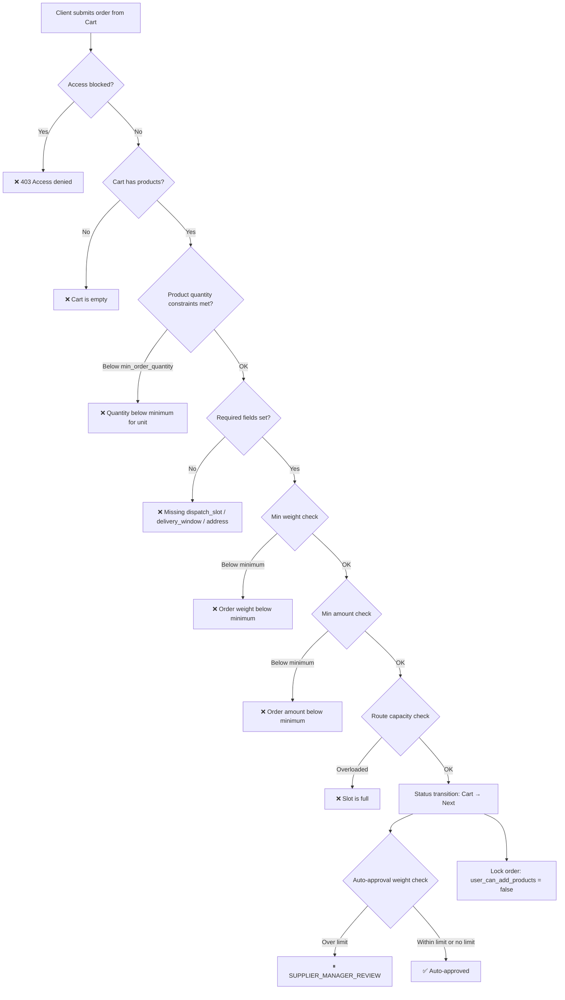

# Order Placement Constraints — Technical Documentation

**Created:** 2026-02-18
**Last Updated:** 2026-02-18

## Overview

The system enforces a multi-layered constraint system for order placement. Constraints operate at two levels:

- **Order level** — access blocking, minimum weight, minimum amount, delivery scheduling, calendar, vehicle capacity, status transitions
- **Product level** — minimum order quantity per unit, orderable unit restrictions

All constraints are actively enforced through Django model validations, serializer validations, and view logic.

## Architecture

### Checkout Validation Flow



## 1. Access & Blocking Constraints

Multi-level blocking system that prevents order creation at different levels of the platform hierarchy.

### Blocking Levels

| Level | Model | Controlled By | Effect |
|-------|-------|---------------|--------|
| Platform → Client | `ClientControlledByPlatform.is_blocked` | Platform admin | Blocks ALL client users from accessing the platform |
| Platform → Supplier | `SupplierSettingsPlatformControlled.is_blocked` | Platform admin | Blocks supplier and all its users; clients cannot view catalog or create orders |
| Supplier (self) | `SupplierSettingsSelfControlled.is_blocked` | Supplier admin | Blocks all non-admin users and order creation for all clients |
| Supplier → Client | `ClientSettingsSupplierControlled.is_blocked` | Supplier admin | Blocks specific client from catalog access and order placement; saved orders remain accessible |
| Client (self) | `ClientSettingsSelfControlled.is_blocked` | Client admin | Blocks all non-admin users of the client from access and order creation |

### Key Files

| File | What |
|------|------|
| `app/preferences/models.py` | All blocking models and fields |
| `app/identity/views.py` | Enforcement of platform-level blocking |

## 2. Product-Level Quantity Constraints

Constraints on **individual order lines**, enforced at the `Unit` level of each product.

### Unit Ordering Rules

Two fields on the `Unit` model control what and how much can be ordered:

| Field | Type | Default | Description |
|-------|------|---------|-------------|
| `Unit.is_orderable` | `BooleanField` | `True` | Whether this unit can be selected when adding to order. Non-orderable units are hidden from the order UI |
| `Unit.min_order_quantity` | `PositiveIntegerField`, nullable | `None` | Minimum quantity of this unit per order line. `None` = no minimum (1 is enough) |

### How It Works

**Example: Ice product**

```
Product: Ice Bags
├── PRIMARY:   1 bag (pcs)       → is_orderable=False              (cannot order individual bags)
├── SECONDARY: 1 box = 12 bags   → is_orderable=True, min_order_quantity=3  (min 3 boxes)
└── TERTIARY:  1 pallet = 40 boxes → is_orderable=True, min_order_quantity=1  (min 1 pallet)
```

**Client experience:**

1. When adding Ice to order, client only sees orderable units: "Box (12 bags)" and "Pallet (40 boxes)"
2. If client selects "Box" and enters quantity 2 → validation error: "Minimum order: 3 boxes"
3. If client selects "Box" and enters quantity 3 → OK

**Another example: Surgical gloves**

```
Product: Surgical Gloves
├── PRIMARY:   1 box (100 pcs)    → is_orderable=True, min_order_quantity=None  (any quantity)
├── SECONDARY: 1 carton = 10 boxes → is_orderable=True, min_order_quantity=None  (any quantity)
```

Here both units are orderable with no minimum — client can order 1 box or 1 carton.

### Validation

**When adding to cart:** Client can only select `is_orderable=True` units. API rejects attempts to add non-orderable units.

**At checkout:** Each `OrderProducts` line is validated:

```python
if unit.min_order_quantity and order_line.quantity < unit.min_order_quantity:
    raise ValidationError(
        f"Minimum order for {product.name} is {unit.min_order_quantity} {unit.classifier.abbr}"
    )
```

### Important Notes

- **No per-client override.** Quantity constraints are the same for all clients (set by supplier at the product level).
- **No cross-line aggregation.** If a client has two lines of the same product in different units, each line is validated independently.
- Constraints are set per **unit**, not per product — different packaging levels can have different minimums.

### Key Files

| File | What |
|------|------|
| `app/products/models.py` | `Unit.is_orderable`, `Unit.min_order_quantity` fields |
| `app/orders/serializers.py` | Validation when adding to cart |
| `app/statuses/services.py` | Validation at checkout in `_validate_cart_exit()` |

## 3. Order Minimum Constraints (Weight & Amount)

Both constraints are checked **independently (AND)**. If both are configured, the order must satisfy **both** to pass checkout. Each can be `NULL` (disabled).

!!! info "Why AND, not OR"
    Weight and amount serve different business purposes:

    - **Min weight** — logistics constraint (no point dispatching a vehicle for 500g)
    - **Min amount** — economic constraint (no point processing a 2 CHF order)

    A heavy but cheap order (50 kg of ice for 15 CHF) can fail on amount while passing weight. A light but expensive order (1 kg of pharmaceuticals for 500 CHF) can fail on weight while passing amount.

### Minimum Order Weight

Orders below the configured minimum weight cannot be placed.

| Setting | Model | Description |
|---------|-------|-------------|
| Supplier default | `SupplierSettingsSelfControlled.min_order_weight_kg` | Minimum total weight required for an order |
| Client override | `ClientSettingsSupplierControlled.min_order_weight_kg` | Per-client override of supplier's minimum |

**Resolution order:** Client override → Supplier default → No limit (`None`).

**Validation:** Enforced in `_validate_cart_exit()` (`app/statuses/services.py`). Raises `ValidationError` if order weight is below the configured minimum.

### Minimum Order Amount

Orders below the configured minimum amount cannot be placed.

| Setting | Model | Description |
|---------|-------|-------------|
| Supplier default | `SupplierSettingsSelfControlled.min_order_amount` | Minimum `total_sum` required for an order. `DecimalField(10,2)`, nullable, validated ≥ 0 |
| Client override | `ClientSettingsSupplierControlled.min_order_amount` | Per-client override of supplier's minimum. Same field type |

**Resolution order:** Client override → Supplier default → No limit (`None`).

**Validation:** Enforced in `_validate_cart_exit()` (`app/statuses/services.py`). Compares `Order.total_sum` against the resolved minimum. Currency is taken from the order (`Order.currency`).

**Error:** `"Order amount {amount} {currency} is below minimum {min} {currency}"`

### Maximum Auto-Approval Weight

Orders exceeding this weight require manual manager approval before proceeding.

| Setting | Model | Description |
|---------|-------|-------------|
| Supplier default | `SupplierSettingsSelfControlled.max_auto_order_weight_kg` | Orders above this require manager approval |
| Client override | `ClientSettingsSupplierControlled.max_auto_order_weight_kg` | Per-client override of supplier's limit |

**Resolution order:** Client override → Supplier default → No limit (auto-approve all).

**Logic** (in `_try_auto_approve_manager_review()`, `app/statuses/services.py`):

- `max_auto_weight_kg` is `NULL` → auto-approve
- Order weight ≤ `max_auto_weight_kg` → auto-approve
- Order weight > `max_auto_weight_kg` → stays in `SUPPLIER_MANAGER_REVIEW` pending manual approval

### Order Limits Resolution

```python
# app/orders/services.py — get_order_limits()
# Priority: client-specific override > supplier default > None

min_weight = client_settings.min_order_weight_kg or supplier_settings.min_order_weight_kg
min_amount = client_settings.min_order_amount    or supplier_settings.min_order_amount
max_auto   = client_settings.max_auto_order_weight_kg or supplier_settings.max_auto_order_weight_kg
```

### Key Files

| File | What |
|------|------|
| `app/preferences/models.py` | Weight and amount limit fields on settings models |
| `app/orders/services.py` | `get_order_limits()` — resolves effective limits |
| `app/statuses/services.py` | `_validate_cart_exit()`, `_try_auto_approve_manager_review()` |

## 4. Delivery Scheduling Constraints

### Lead Time

| Setting | Field | Default | Description |
|---------|-------|---------|-------------|
| Minimum lead time | `SupplierSettingsSelfControlled.min_lead_time_hours` | 4 hours | Minimum hours between order placement and earliest delivery slot |
| Maximum lead time | `SupplierSettingsSelfControlled.max_lead_time_days` | 14 days | Maximum days into the future for scheduling delivery |

**Validation:** Enforced in `generate_delivery_windows()` (`app/delivery_scheduling/services.py`). Only slots that satisfy both constraints are returned as available.

### Order Deadline (Cutoff Time)

| Setting | Field | Default | Description |
|---------|-------|---------|-------------|
| Deadline offset | `DispatchSlot.order_deadline_offset_minutes` | 120 min | Minutes before dispatch time when orders stop being accepted |

**Calculation:**

```python
deadline_datetime = dispatch_datetime - timedelta(minutes=slot.order_deadline_offset_minutes)
```

### Key Files

| File | What |
|------|------|
| `app/preferences/models.py` | Lead time fields |
| `app/delivery_scheduling/models.py` | `DispatchSlot.order_deadline_offset_minutes` |
| `app/delivery_scheduling/services.py` | `generate_delivery_windows()` — applies all scheduling constraints |

## 5. Calendar Availability Constraints

### Operating Calendar

Defines the days and hours when the supplier operates.

| Model | Fields | Description |
|-------|--------|-------------|
| `OperatingCalendar` | `weekday`, `time_from`, `time_to` | Regular operating schedule per weekday |

**Rules:**

- Start time must be before end time
- No overlapping intervals on the same weekday
- Only days/hours with entries are available for delivery

### Exception Calendar (Holidays/Closures)

Overrides the operating calendar for specific dates.

| Model | Fields | Description |
|-------|--------|-------------|
| `ExceptionCalendar` | `date`, `is_closed`, `time_from`, `time_to`, `description` | Per-date exceptions |

**Rules:**

- One exception per date per supplier (unique constraint)
- `is_closed=True` → date is completely unavailable for delivery
- `is_closed=False` → overrides normal operating hours with custom time window

### Dispatch Slot Validity

| Fields | Description |
|--------|-------------|
| `DispatchSlot.valid_from`, `DispatchSlot.valid_to` | Inclusive date range when the slot is active |

**Rules:**

- `valid_from` ≤ `valid_to`
- Slot is only available within this date range (if set; `NULL` means no restriction)

### Key Files

| File | What |
|------|------|
| `app/delivery_scheduling/models.py` | `OperatingCalendar`, `ExceptionCalendar`, `DispatchSlot` |
| `app/delivery_scheduling/services.py` | Slot generation logic with calendar checks |

## 6. Route Capacity Constraints (Vehicle Weight)

When a `DispatchSlot` has an assigned `Vehicle`, the system enforces vehicle weight capacity.

| Check | Description |
|-------|-------------|
| Trigger | Weight control enabled only when `DispatchSlot.vehicle` is set |
| Limit | `Vehicle.total_capacity` (kg) |
| Error | `"Slot is full for selected date. Current load: {current} kg, vehicle capacity: {capacity} kg, your order: {order} kg"` |

**Concurrency:** Uses Row-Level Locking (RLS) to prevent race conditions during concurrent checkouts.

### Key Files

| File | What |
|------|------|
| `app/fleet_management/services/route_capacity.py` | Capacity validation logic with RLS |
| `app/orders/views.py` | Checkout view — calls capacity check |

## 7. Required Fields at Checkout

The following fields must be set on the order before checkout is allowed:

| Field | Description |
|-------|-------------|
| `dispatch_slot` | The dispatch slot for the order |
| `delivery_window_from` | Delivery time window start |
| `delivery_address` | Delivery address (also used for auto-assigning delivery zone) |

**Validation:** Enforced in `CartCheckoutSerializer.validate()` (`app/orders/serializers.py`).

## 8. Order Locking After Placement

| Mechanism | Field | Effect |
|-----------|-------|--------|
| Product lock | `Order.user_can_add_products = False` | Set after successful checkout; prevents adding/modifying products |
| Full lock | `Order.is_locked = True` (via `LockableMixin`) | Auto-set on transition to delivery/invoiced/paid statuses; prevents all modifications |
| Unlock | Manual only | Manager/Admin via `POST /orders/{id}/unlock/` |

## 9. Status Transition Constraints

Order status transitions are governed by `StatusFulfillmentTransition` records:

| Field | Description |
|-------|-------------|
| `scheme` | Which fulfillment workflow applies |
| `from_status` / `to_status` | Allowed transition path |
| `triggered_by` | Who can trigger: `CLIENT`, `SUPPLIER`, or `SYSTEM` |

**Key statuses:**

| Status | Meaning |
|--------|---------|
| `CART` | Initial cart — products can be added/modified |
| `SUPPLIER_MANAGER_REVIEW` | Requires manual approval if weight exceeds auto-approval limit |
| `Cancelled` | Terminal status |
| `Delivered` / `Invoiced` / `Paid` | Lock orders from modification |

### Key Files

| File | What |
|------|------|
| `app/statuses/models.py` | `StatusFulfillmentTransition` model |
| `app/statuses/services.py` | Transition logic, validation, auto-approval |

## 10. Delivery Zone Auto-Assignment

| Trigger | `pre_save` signal on `Order` model |
|---------|------|
| Function | `auto_assign_delivery_zone()` |
| Requirements | `delivery_address` must exist and have coordinates (lat/lng) |
| Behavior | Automatically assigns zone based on address geocoding; skipped if zone already set (allows manual override) |

### Key Files

| File | What |
|------|------|
| `app/orders/models.py` | `auto_assign_delivery_zone()` signal handler |

## Summary: Constraint Resolution Order at Checkout

```
 1. Access check         — Is client/supplier blocked?
 2. Cart validation      — Are there products in the cart?
 3. Product quantities   — Each line: quantity ≥ unit.min_order_quantity (if set)
 4. Required fields      — dispatch_slot, delivery_window_from, delivery_address
 5. Min weight check     — client override > supplier default > no limit
 6. Min amount check     — client override > supplier default > no limit
    (5 and 6 are checked independently — both must pass if configured)
 7. Route capacity       — vehicle total_capacity vs. current slot load + order weight
 8. Status transition    — Cart → next status (per fulfillment scheme)
 9. Auto-approval        — weight vs. max_auto_order_weight_kg
10. Lock order           — user_can_add_products = false
```
