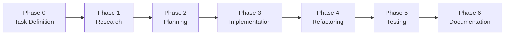

# Tasks

## Workflow Overview

Development follows a **7-phase methodology** where each task goes through a structured lifecycle:



| Phase | Purpose | Output |
|-------|---------|--------|
| **Phase 0** | Define the task, ask clarifying questions, find benchmarks | Refined task description with success criteria |
| **Phase 1** | Research current architecture, dependencies, patterns | Architecture overview and constraints |
| **Phase 2** | Design the implementation plan | Step-by-step plan with risks |
| **Phase 3** | Write the code | Working implementation |
| **Phase 4** | Review and refactor | Clean, maintainable code |
| **Phase 5** | Write and run tests | All tests passing |
| **Phase 6** | Create documentation for 4 audiences | Docs for AI chatbot, devs, admins, users |

## Task Files

Tasks are stored in the main project repository at `docs/_ai_context/`:

```
docs/_ai_context/
├── CURRENT_TASK_*.md              # Active task (single source of truth)
├── COMPLETED_TASKS/               # Archived completed tasks
│   ├── 2025-12-04-feature-name.md
│   └── 2025-12-14-another-feature.md
├── 01. Workflow.md                # Full methodology reference
├── 02. Current task template.md   # Task file template
├── 03. Quick reference.md         # Cheatsheet
├── 04. Readme.md                  # Getting started
└── 05. Docs structure.md          # Documentation guide
```

## Phase 6: Documentation for 4 Audiences

When a task is completed, documentation must be created for **4 audiences**:

| Audience | What they need | Location |
|----------|---------------|----------|
| [AI Chatbot](templates/ai-chatbot.md) | FAQ-style answers for support bot + Claude Code context | `docs/support/chatbot/` + `docs/_ai_context/` |
| [Developers](templates/developers.md) | Architecture, API, models, code examples | `docs/architecture/django-backend/workflows/` |
| [Platform Admins](templates/admins.md) | Django admin setup, configuration, management | `docs/features/[app]/[feature]/admin-guide.md` |
| [End Users](templates/users.md) | Step-by-step guides with screenshots | `docs/features/[app]/[feature]/user-guide.md` |

See [Templates](templates/ai-chatbot.md) for ready-to-use templates for each audience.

## Quick Links

- [Current Task](current.md) — what's being worked on right now
- [Completed Tasks](completed.md) — archive of all finished tasks
