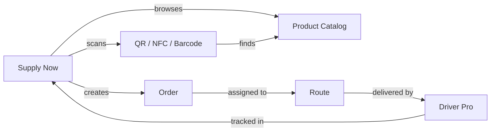

# 3. Client / Buyer — Supply Now

**Application:** Supply Now
**Platform:** Web, Android
**Roles:** Admin, Manager

---

## Role Description

The Client (buyer) uses the Supply Now application to browse supplier catalogs, place orders, track deliveries, and manage their company profile. The app is designed for B2B ordering with support for multiple suppliers, QR/NFC scanning, and real-time delivery tracking.

---

## Screens & Features

### Home

Main screen with supplier selection and product browsing.

| Function | Description |
|----------|-------------|
| Supplier selector | Switch between linked suppliers (top of screen) |
| Blocking indicators | Visual warning when supplier is blocked or you blocked the supplier |
| Category grid | Browse product categories for selected supplier |
| Quick search | Find products by name or article code |

### Categories & Products

Product catalog browsing.

| Function | Description |
|----------|-------------|
| Category view | Products grouped by supplier categories |
| Product list | Products with images, prices, units |
| Product detail | Full description, images, unit options |
| Unit selection | Choose packaging level (piece, box, pallet) |
| Price display | Price per selected unit with VAT indication |
| Add to cart | Select quantity and unit, add to shopping cart |

### QR Code & NFC

Quick product search via scanning.

| Function | Description |
|----------|-------------|
| QR scan | Scan product QR code to view/add product |
| NFC read | Read NFC tags for product identification |
| Barcode scan | Scan product barcodes |

### Cart

Shopping cart management.

| Function | Description |
|----------|-------------|
| Cart items | View all added products with quantities |
| Edit quantities | Change product quantities |
| Remove items | Remove products from cart |
| Order summary | Subtotal, tax, total price |
| Unit display | Show selected packaging unit per product |

### Checkout

Order finalization and submission.

| Function | Description |
|----------|-------------|
| Delivery address | Select from saved addresses or create new |
| Delivery slot | Select available dispatch slot |
| Order review | Final review of items, address, slot |
| Submit order | Place order with supplier |

### Orders

Order history and tracking.

| Function | Description |
|----------|-------------|
| Order list | All orders with status and date filters |
| Order detail | Items, quantities, prices, status, delivery info |
| Status history | Track order through workflow states |
| Driver tracking | Real-time map with driver location |
| Delivery window | Estimated delivery time range |

### Profile

Account and company management.

| Function | Description |
|----------|-------------|
| **Personal tab** | Name, email, phone, language, notification preferences |
| **Company tab** | Company details (name, VAT, address, logo) |
| **Suppliers tab** | List of linked suppliers with settings |

#### Suppliers Tab Details

| Function | Description |
|----------|-------------|
| Supplier list | All linked suppliers with blocking status |
| Fulfillment scheme | Delivery or Pickup (read-only) |
| Invoicing period | Manual, per order, daily, weekly, monthly (read-only) |
| Blocked by Supplier | Red badge, no actions available |
| Blocked by Client | Admin can toggle block/unblock |
| Block toggle | Admin-only: block supplier with confirmation dialog |
| Refresh | Pull-to-refresh and refresh button |

---

## Blocking Logic

The platform has a two-way blocking mechanism:

| Scenario | Who Blocks | Effect |
|----------|-----------|--------|
| Supplier blocks client | Supplier Admin (via Back Office) | Client cannot place orders with this supplier |
| Client blocks supplier | Client Admin (via Supply Now) | Client cannot place orders with this supplier |
| Platform blocks client | Platform Admin (via Django Admin) | Client cannot use the platform |

!!! warning "Blocking Priority"
    **Blocked by Supplier** takes priority over client-side controls. When a supplier blocks a client, the block toggle is hidden and a red "Blocked by Supplier" badge is shown instead.

---

## Role Differences

| Feature | Admin | Manager |
|---------|-------|---------|
| Browse catalog & place orders | Yes | Yes |
| View orders & tracking | Yes | Yes |
| Edit personal profile | Yes | Yes |
| Edit company details | Yes | Read-only |
| Block/unblock suppliers | Yes | No |
| Edit company settings | Yes | No |
| Switch current client | Yes | Yes |

---

## Data Flow

