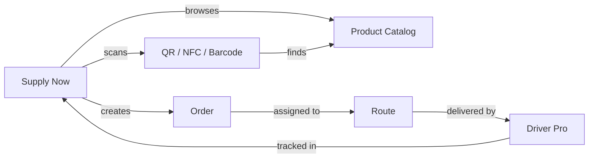

# 3. Client / Buyer — Supply Now

**Application:** Supply Now
**Platform:** Web, Android
**Roles:** Admin, Manager

---

## Role Description

The Client (buyer) uses the Supply Now application to browse supplier catalogs, place orders, track deliveries, and manage their company profile. The app is designed for B2B ordering with support for multiple suppliers, QR/NFC scanning, and real-time delivery tracking.

---

## Screens & Features

### Home

Main screen with supplier selection and product browsing.

| Function | Description |
|----------|-------------|
| Supplier selector | Switch between linked suppliers (top of screen) |
| Blocking indicators | Visual warning when supplier is blocked or you blocked the supplier |
| Category grid | Browse product categories for selected supplier |
| Quick search | Find products by name or article code |

### Categories & Products

Product catalog browsing.

| Function | Description |
|----------|-------------|
| Category view | Products grouped by supplier categories |
| Product list | Products with images, prices, units |
| Product detail | M3-style detail screen with image gallery, pricing card, specifications, availability chip with next delivery date |
| Favorites | Toggle favorite (heart icon) on product cards and detail screen; favorited products persist per client |
| Unit selection | M3 SegmentedButton to choose packaging level (piece, box, pallet); non-orderable units shown but blocked with explanation |
| Price display | Pricing card with primary price per unit and secondary price (e.g., per kg); defaults to orderable unit |
| Specifications | Net weight, supplier reference, and product details shown in specs section |
| Add to cart | Bottom action bar with quantity selector, total price display, total weight, and "Add to bag" button |

### QR Code & NFC

Quick product search via scanning.

| Function | Description |
|----------|-------------|
| QR scan | Scan product QR code to view/add product |
| NFC read | Read NFC tags for product identification |
| Barcode scan | Scan product barcodes |

### Cart

Shopping cart management.

| Function | Description |
|----------|-------------|
| Cart items | View all added products with quantities |
| Edit quantities | Change product quantities |
| Remove items | Remove products from cart |
| Order summary | Subtotal, tax, total price |
| Unit display | Show selected packaging unit per product |

### Checkout

Order finalization and submission.

| Function | Description |
|----------|-------------|
| Delivery address | Select from saved addresses or create new |
| Delivery slot | Select available dispatch slot |
| Order review | Final review of items, address, slot |
| Submit order | Place order with supplier |

### Orders

Order history and tracking.

| Function | Description |
|----------|-------------|
| Order list | All orders with status and date filters |
| Order detail | Items, quantities, prices, status, delivery info |
| Status history | Track order through workflow states |
| Driver tracking | Real-time map with driver location |
| Delivery window | Estimated delivery time range |

### Profile

Account and company management.

| Function | Description |
|----------|-------------|
| **Personal tab** | Name (auto-saves), email, avatar, language, change password |
| **Company tab** | Company details (name, official name, VAT, fiscal number, website, email, description), address purpose slots |
| **Addresses tab** | View, create, edit, delete delivery addresses across all companies |
| **Suppliers tab** | List of linked suppliers with settings |

#### Personal Tab Details

| Function | Description |
|----------|-------------|
| Name editing | First/last name with debounced auto-save (1.5s) |
| Avatar | Upload/clear profile picture (instant save) |
| Change password | Dialog: current password + new password + confirm. Min 8 chars, letters + numbers required |
| Language | Switch app language (EN, DE, FR, IT) — Swiss-style abbreviation badges |

#### Company Tab Details

| Function | Description |
|----------|-------------|
| Company logo | Admin can upload/change logo (camera or gallery via bottom sheet), visible to all users |
| Company name | Display name of the client organization |
| Official name | Registered legal name |
| VAT number | VAT registration number (shown directly under name) |
| **Addresses section** | Separated by `─── ADDRESSES ───` divider with tabulated layout |
| Default delivery address | Shown first with orange icon. Admin can pick from address list. Hint: "Can be changed during checkout" |
| Address purpose slots | Primary, Billing, Registered with aligned labels. Admin can tap to change |
| **Contact Info section** | Separated by `─── CONTACT INFO ───` divider |
| Website | Company website. Admin can edit via bottom sheet |
| Email | Company email. Admin can edit via bottom sheet |
| **Settings section** | Separated by `─── SETTINGS ───` divider |
| Document language | Admin can set preferred language for documents (invoices, delivery notes) |
| Block/unblock company | Admin can self-block company with confirmation dialog |
| Role badge | Shows user's role (Admin/Manager) per company |

#### Addresses Tab Details

| Function | Description |
|----------|-------------|
| Address list | All addresses across all linked companies, each showing company name |
| Purpose badges | Color-coded: green (Primary), blue (Billing), purple (Registered) |
| Google Places search | Autocomplete address search (default: Switzerland) |
| Create address | Admin can add new address with auto-filled fields from Places API |
| Edit address | Admin can edit address (disabled if address has orders) |
| Delete address | Admin can delete address with confirmation (disabled if address has orders) |
| Purpose picker | Admin can set/change/clear purpose (Primary, Billing, Registered) per address |
| Address comment | Shows comment below address text (italic grey, with comment icon) |
| Order protection | Addresses linked to orders show lock icon, cannot be edited or deleted |

#### Suppliers Tab Details

| Function | Description |
|----------|-------------|
| Supplier list | All linked suppliers with blocking status |
| Fulfillment scheme | Delivery or Pickup (read-only) |
| Invoicing period | Manual, per order, daily, weekly, monthly (read-only) |
| Blocked by Supplier | Red badge, no actions available |
| Blocked by Client | Admin can toggle block/unblock |
| Block toggle | Admin-only: block supplier with confirmation dialog |
| Refresh | Pull-to-refresh and refresh button |

---

## Blocking Logic

The platform has a two-way blocking mechanism:

| Scenario | Who Blocks | Effect |
|----------|-----------|--------|
| Supplier blocks client | Supplier Admin (via Back Office) | Client cannot place orders with this supplier |
| Client blocks supplier | Client Admin (via Supply Now) | Client cannot place orders with this supplier |
| Platform blocks client | Platform Admin (via Django Admin) | Client cannot use the platform |

!!! warning "Blocking Priority"
    **Blocked by Supplier** takes priority over client-side controls. When a supplier blocks a client, the block toggle is hidden and a red "Blocked by Supplier" badge is shown instead.

---

## Role Differences

| Feature | Admin | Manager |
|---------|-------|---------|
| Browse catalog & place orders | Yes | Yes |
| View orders & tracking | Yes | Yes |
| Edit personal profile | Yes | Yes |
| Edit company details | Yes | Read-only |
| Upload/change company logo | Yes | No |
| Manage addresses (CRUD) | Yes | Read-only |
| Set address purpose | Yes | No |
| Block/unblock suppliers | Yes | No |
| Block/unblock own company | Yes | No |
| Edit contact info (website, email) | Yes | No |
| Set default delivery address | Yes | No |
| Edit company settings | Yes | No |
| Switch current client | Yes | Yes |

---

## Data Flow

