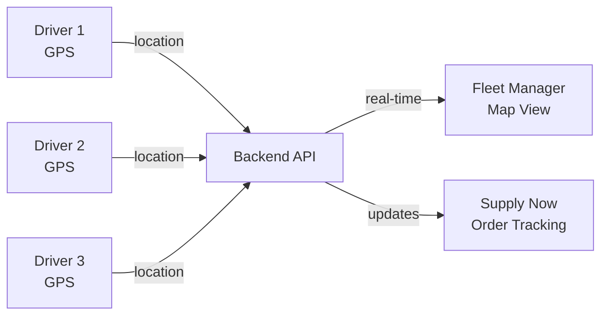
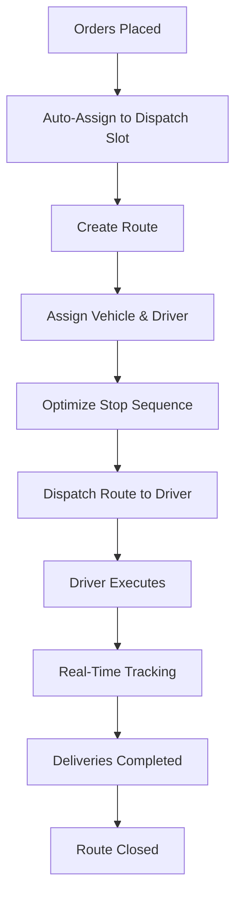

# 5. Delivery Manager — Fleet Manager

**Application:** Fleet Manager (Fleet Planner)
**Platform:** macOS, Web
**Roles:** Admin, Manager

---

## Role Description

The Delivery Manager (dispatcher) uses the Fleet Manager application to plan delivery routes, manage the vehicle fleet, assign drivers, and track deliveries in real-time. The app is designed as a desktop dashboard with a 3-column layout: orders, map, and fleet/routes.

---

## Screens & Features

### Dashboard

Main operational screen with 3-panel layout.

| Panel | Content |
|-------|---------|
| **Left** | Unassigned orders awaiting dispatch |
| **Center** | Map with delivery zones, routes, and driver positions |
| **Right** | Vehicles, routes, and driver assignments |

| Function | Description |
|----------|-------------|
| Date navigator | Switch between planning days |
| Real-time updates | Auto-refresh with live data |
| Delivery zone overlay | Zones shown as colored polygons on map |
| Driver positions | Live GPS dots on map (color-coded by status) |

### Order Management

| Function | Description |
|----------|-------------|
| Unassigned orders | Orders not yet assigned to a route |
| Order details | Client, address, weight, delivery window |
| Filter orders | By zone, date, weight, client |
| Drag-and-drop | Assign orders to vehicles/routes |
| Auto-assign | Assign orders to dispatch slots by zone |
| Create order | Manual order creation for supplier |

### Route Planning

| Function | Description |
|----------|-------------|
| Create route | New route with vehicle, driver, dispatch slot |
| Add stops | Assign orders as delivery stops |
| Optimize sequence | Reorder stops for efficiency |
| Route metrics | Distance (km), duration (min), stops count, total weight |
| Route status | Scheduled, in progress, completed |
| Departure time | Set departure from depot |
| Return deadline | Time vehicle must return to depot |
| Order deadline | Cutoff time for accepting new orders |

### Fleet Management

| Function | Description |
|----------|-------------|
| Vehicle list | All vehicles with status |
| Vehicle status | Ready, In Transit, Maintenance, Out of Service |
| Vehicle capacity | Total weight capacity (kg) |
| Home depot | Vehicle's default depot |
| License plate | Vehicle identification |
| Assign to route | Link vehicle to delivery route |

### Driver Management

| Function | Description |
|----------|-------------|
| Driver list | All drivers with availability |
| Driver status | Active/inactive, current route |
| Location history | GPS track for the day |
| Assign to route | Link driver to delivery route |
| Last known position | Latest GPS coordinates and timestamp |

### Fleet Settings

Supplier-wide fleet configuration.

| Setting | Description |
|---------|-------------|
| Service time per stop | Average minutes per delivery (for route estimation) |
| Operating hours | Per-weekday working hours |
| Exception dates | Holidays, closed days |
| Delivery zones | Geographic boundaries (cantons, cities, postal codes, GeoJSON) |
| Dispatch slots | Scheduled departure times with zone and vehicle assignment |
| Depots | Warehouse locations with addresses |

### Workflow Editor

Visual workflow builder for delivery processes.

| Function | Description |
|----------|-------------|
| Status workflows | Define states and transitions for routes and stops |
| Drag-and-drop | Visual workflow creation |
| Status contexts | Order, route, route stop workflows |

### Profile

Personal profile management accessible via user avatar menu in the AppBar.

| Function | Description |
|----------|-------------|
| Avatar | Upload or remove profile picture (S3 storage) |
| Name editing | First and last name with auto-save (1.5s debounce) |
| Email | Read-only display |
| Phone | Read-only display |
| Change password | Dialog with current/new/confirm fields, validation |
| Language | Selector with supported locales (EN, DE, FR, IT) |
| Logout | Confirmation dialog, clears session |

---

## Real-Time Tracking

| Feature | Description |
|---------|-------------|
| Live map | All driver positions updated in real-time |
| Route visualization | Active route shown on map with stops |
| Delivery progress | Completed vs pending stops |
| ETA updates | Estimated arrival at next stop |
| Exception alerts | Notification when delivery fails |

---

## Dispatch Slot Configuration

Dispatch slots define when deliveries depart and what zones they serve.

| Parameter | Description |
|-----------|-------------|
| Cycle type | **By weekday** (Mon, Tue...) or **By interval** (every N days) |
| Dispatch time | Time of departure from depot |
| Departure depot | Starting warehouse |
| Return depot | Destination warehouse (if different) |
| Delivery zone | Geographic area served |
| Vehicle | Default vehicle (controls weight capacity) |
| Order deadline | Minutes before dispatch when orders stop being accepted |
| Return deadline | Time vehicle must return |
| Valid from/to | Date range when slot is active |

---

## Route Lifecycle

