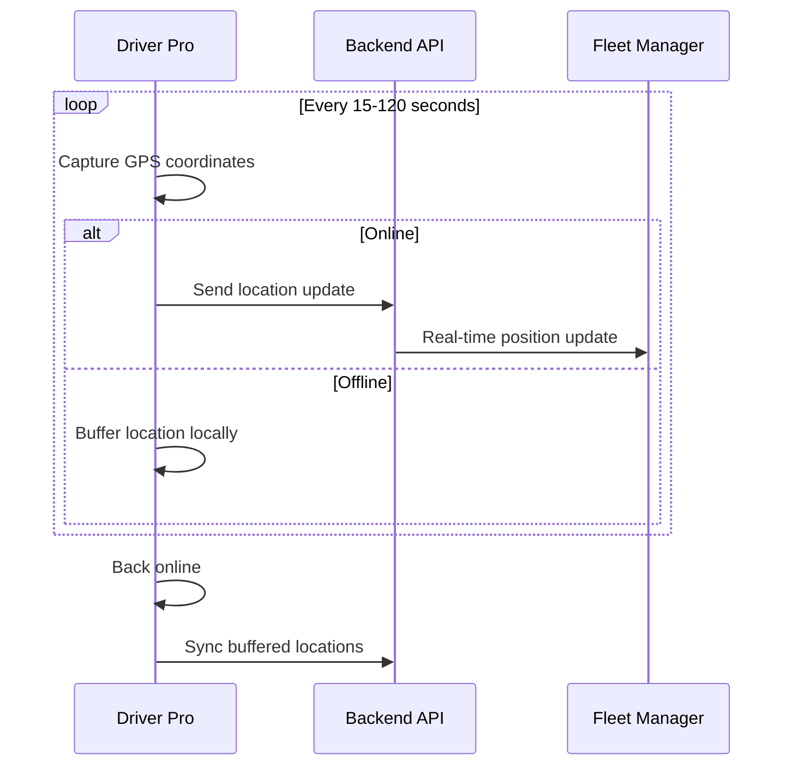
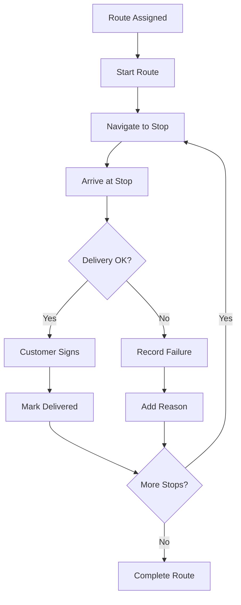

# 4. Supplier Driver — Driver Pro

**Application:** Driver Pro
**Platform:** Android, iOS
**Role:** Courier

---

## Role Description

The Driver uses the Driver Pro mobile application to execute deliveries. The app provides assigned routes with navigation, GPS tracking, delivery confirmation with signatures, and performance statistics. It is designed for use on the road with minimal interaction required.

---

## Screens & Features

### Routes List

Main screen showing today's assigned routes.

| Function | Description |
|----------|-------------|
| Active routes | List of routes assigned to driver for today |
| Route summary | Number of stops, total weight, estimated duration |
| Route status | Scheduled, in progress, completed |
| Start route | Begin route execution |

### Route Detail

Overview of a single route with all delivery stops.

| Function | Description |
|----------|-------------|
| Stop list | Ordered list of delivery addresses |
| Stop sequence | Optimized delivery order (1, 2, 3...) |
| Client info | Company name and delivery address per stop |
| Order summary | Items count and weight per stop |
| Route map | Visual map with all stops and route |
| Vehicle info | Assigned vehicle details |

### Active Route

Main working screen during route execution.

| Function | Description |
|----------|-------------|
| Current stop | Highlighted next delivery |
| Navigation | Turn-by-turn directions to next stop |
| GPS tracking | Real-time location sent to server (15-120 sec intervals) |
| Distance tracking | Distance filter to reduce GPS noise (10m minimum) |
| Offline mode | Locations buffered and synced when back online |
| Progress | Completed vs remaining stops |

### Delivery Detail

Individual delivery stop with order products.

| Function | Description |
|----------|-------------|
| Client info | Company name, address, contact |
| Order items | Products, quantities, units |
| Special instructions | Delivery notes from client or dispatcher |
| Delivery window | Expected delivery time range |
| Arrive | Record actual arrival time |
| Complete delivery | Mark stop as delivered |
| Delivery failure | Record failure with reason code |

### Signature Capture

Proof of delivery confirmation.

| Function | Description |
|----------|-------------|
| Signature pad | Touch/stylus signature capture |
| Recipient name | Name of person who received delivery |
| GPS coordinates | Auto-captured location at signature time |
| Device info | Device details for audit trail |
| Save | Upload signature image to server |

### Completed Routes (History)

Past delivery performance.

| Function | Description |
|----------|-------------|
| Route history | List of completed routes by date |
| Route detail | Read-only view of past route |
| Delivery statuses | Success/failure per stop |
| Signatures | View captured signatures |

### Statistics

Driver performance metrics.

| Function | Description |
|----------|-------------|
| Deliveries count | Total deliveries completed |
| Success rate | Percentage of successful deliveries |
| Routes completed | Number of routes |
| Performance trends | Charts and metrics over time |

---

## GPS Tracking

| Setting | Value | Description |
|---------|-------|-------------|
| Tracking interval | 15-120 sec | Configurable per supplier |
| Distance filter | 10m | Minimum movement to record |
| Offline buffer | Unlimited | Synced when back online |

---

## Delivery Workflow

