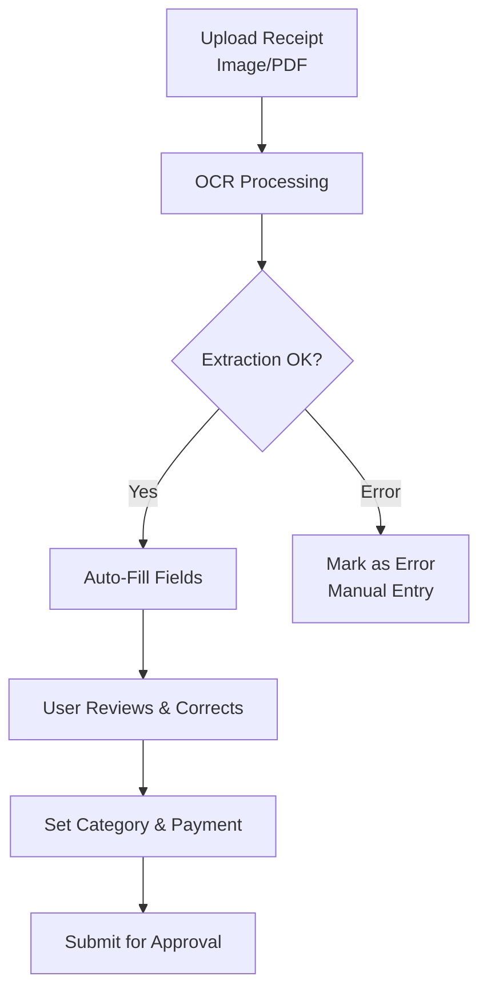
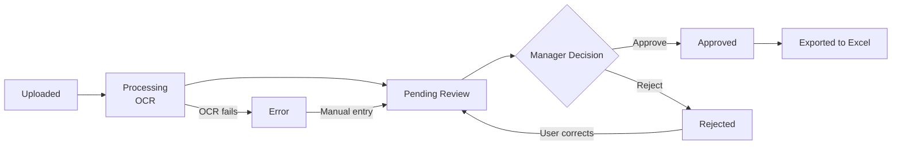

# 6. Employee — DocuFlow

**Application:** DocuFlow
**Platform:** macOS, Web (mobile-capable)
**Users:** Drivers, accountants, and other employees of suppliers or clients

---

## Role Description

DocuFlow is a document processing application used by employees of both suppliers and clients. Its primary function is receipt scanning and expense management with automatic OCR (optical character recognition). Employees photograph or upload receipts, the system extracts data automatically, and managers review and approve expenses.

---

## Screens & Features

### Dashboard

Overview of recent activity and pending items.

| Function | Description |
|----------|-------------|
| Recent receipts | Last uploaded receipts with status |
| Pending review | Receipts awaiting approval |
| Quick stats | Total expenses, approved, pending counts |

### Receipt Scanning

Upload and process receipts.

| Function | Description |
|----------|-------------|
| Camera capture | Photograph receipt via mobile camera |
| File upload | Upload images (JPEG, PNG, HEIC, WebP) or PDF documents |
| Auto-OCR | Automatic text extraction after upload |
| Processing status | Real-time feedback during OCR |

### Receipts List

Browse and manage all receipts.

| Function | Description |
|----------|-------------|
| Receipt list | All receipts with status, date, amount |
| Full-text search | Search by date range, merchant, category |
| Filter by status | Pending, processing, approved, rejected, error |
| Filter by category | Office supplies, travel, meals, etc. |
| Filter by payment | Personal card, corporate card, cash |
| Sort by date | Chronological ordering |

### Receipt Detail

View and edit individual receipt data.

| Function | Description |
|----------|-------------|
| Receipt image | Full-screen image viewer with zoom |
| Merchant info | Extracted name and address |
| Amount & currency | Transaction total, auto-detected currency |
| Date & time | Transaction date from receipt |
| Tax/VAT | Extracted tax amounts |
| OCR confidence | Accuracy score per field |
| Manual correction | Edit any OCR-extracted field |
| Category | Assign expense category |
| Purpose/notes | Add description or reason |
| Payment method | Personal card, corporate card, cash |
| Status | Current processing/approval state |

### Profile

User account settings.

| Function | Description |
|----------|-------------|
| Personal info | Name, email, phone |
| Language | Preferred UI language |
| Notification settings | Email/push preferences |

---

## OCR Processing

### Extracted Fields

| Field | Description | Example |
|-------|-------------|---------|
| Merchant name | Store or company name | "Migros Lausanne" |
| Merchant address | Location of purchase | "Rue de Bourg 34, 1003 Lausanne" |
| Date | Transaction date | 2026-02-15 |
| Amount | Total amount | 45.80 |
| Currency | Auto-detected | CHF |
| Tax/VAT | Tax amount if present | 3.30 |

---

## Expense Categories

| Category | Description |
|----------|-------------|
| Office Supplies | Stationery, printer ink, etc. |
| Travel | Transportation, fuel, parking |
| Meals & Entertainment | Business meals, client meetings |
| Equipment | Tools, hardware, accessories |
| Services | Subscriptions, external services |
| Other | Uncategorized expenses |

---

## Receipt Status Workflow

| Status | Description |
|--------|-------------|
| Processing | OCR in progress |
| Pending Review | Awaiting manager approval |
| Approved | Accepted for reimbursement |
| Rejected | Returned for correction |
| Error | OCR failed, needs manual entry |
| Saved to Excel | Exported to expense reporting |

---

## Multi-Currency Support

| Feature | Description |
|---------|-------------|
| Auto-detection | Currency detected from receipt text |
| Base currency | CHF (Swiss Francs) |
| Exchange rates | Automatic conversion to base currency |
| VAT recovery | CHF receipts: VAT recoverable; foreign: not recoverable |

---

## Use Cases

| User | Scenario |
|------|----------|
| **Driver** | Photographs fuel receipts, parking tickets during deliveries |
| **Manager** | Reviews and approves team expense receipts |
| **Accountant** | Exports approved receipts to Excel for bookkeeping |
| **Employee** | Submits office supply purchases for reimbursement |
