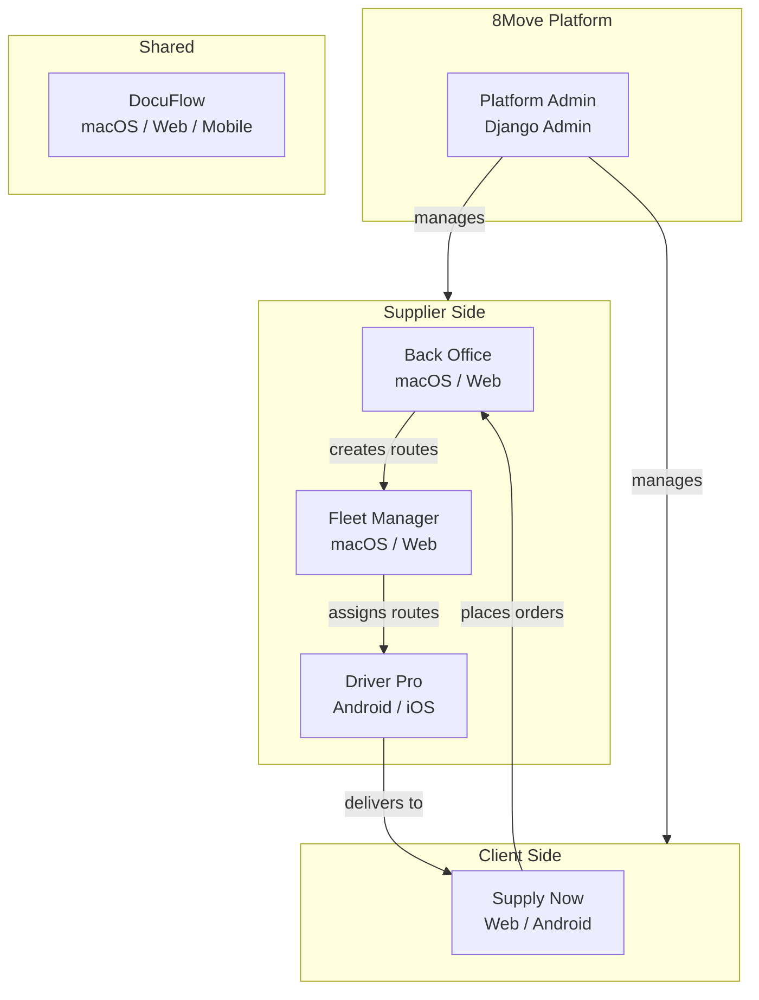

# User Roles & Applications

The 8Move platform serves six types of users, each with a dedicated application tailored to their workflow.

## Platform Overview

## User Roles

| # | Role | Application | Platform | Description |
|---|------|-------------|----------|-------------|
| 1 | [Platform Admin](platform-admin.md) | Django Admin | Web | Full platform management, user onboarding, system configuration |
| 2 | [Supplier](supplier-back-office.md) | Back Office | macOS, Web | Product catalog, orders, invoicing, delivery settings |
| 3 | [Client / Buyer](client-supply-now.md) | Supply Now | Web, Android | Browse catalog, place orders, track deliveries |
| 4 | [Driver](driver-driver-pro.md) | Driver Pro | Android, iOS | Execute deliveries, navigate routes, capture signatures |
| 5 | [Delivery Manager](delivery-manager-fleet-manager.md) | Fleet Manager | macOS, Web | Plan routes, manage fleet, track deliveries in real-time |
| 6 | [Employee](employee-docuflow.md) | DocuFlow | macOS, Web | Scan receipts, manage expenses, document processing |

## Access Control

The platform uses **Role-Based Access Control (RBAC)** with three levels:

| Level | Roles | Scope |
|-------|-------|-------|
| **Platform** | Admin, Manager | Full system access via Django Admin |
| **Supplier** | Admin, Manager, Courier | Access to supplier's own data only |
| **Client** | Admin, Manager | Access to client's own data and linked suppliers |

!!! info "Data Isolation"
    Each supplier sees only their own clients, products, and orders. Each client sees only their linked suppliers. This is enforced at the API level via **Row-Level Access (RLA)** filtering.
