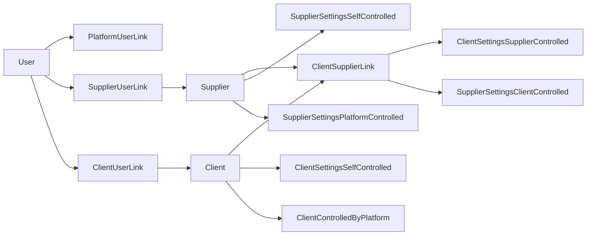

# 1. Platform Admin — Django Admin

**Application:** Django Admin Panel
**Platform:** Web (desktop browser)
**URL:** `https://<domain>/admin/`

---

## Role Description

The Platform Admin has full access to the 8Move system through the Django Admin panel. This role is responsible for onboarding new suppliers and clients, configuring platform-wide settings, managing user access, and monitoring all business operations.

---

## Key Functional Areas

### User & Access Management

| Function | Description |
|----------|-------------|
| Create user accounts | Register users for any app (supplier, client, driver) |
| Assign roles | Set role per link: Admin, Manager, Courier |
| Platform links | `PlatformUserLink` — grant platform-level access |
| Supplier links | `SupplierUserLink` — assign user to supplier with role |
| Client links | `ClientUserLink` — assign user to client with role |
| Authentication | Email-based auth, password reset, email verification |

### Supplier Management

| Function | Description |
|----------|-------------|
| Create suppliers | Name, official name, VAT, fiscal number, logo |
| Supplier addresses | Primary, billing, registered addresses |
| Bank accounts | IBAN, BIC, currency, account holder (for invoices) |
| Supplier settings | Currency, lead times, VAT mode, invoicing period |
| Block supplier | `SupplierSettingsPlatformControlled.is_blocked` |
| Force delete supplier | Bulk action — deletes supplier with ALL dependent data (orders, invoices, products, depots, etc.) bypassing PROTECT constraints. Use with caution. |

### Client Management

| Function | Description |
|----------|-------------|
| Create clients | Company details, addresses, contacts |
| Client-Supplier links | `ClientSupplierLink` — establish business relationships |
| Client settings | Default delivery address, notification preferences |
| Block client | `ClientControlledByPlatform.is_blocked` |
| Supplier-controlled settings | Per-link: fulfillment scheme, invoicing period, min/max order weight |

### Products & Catalog

| Function | Description |
|----------|-------------|
| Unit classifiers | kg, pieces, boxes, pallets, etc. |
| Tax rates | Per-supplier VAT rates |
| Products | View all supplier products, article codes, prices |
| PLU codes | Auto-generated 5-digit codes for weighable items |
| Barcodes & QR codes | Product identification codes |
| Categories | Hierarchical product categories per supplier |

### Orders & Invoicing

| Function | Description |
|----------|-------------|
| View all orders | Cross-supplier order overview |
| Order status history | Full audit trail of status transitions |
| Status fulfillment schemes | Define workflow states and transitions |
| Invoices | View, lock, track invoices |
| Invoice templates | Configure numbering format and prefixes |
| Payment terms | Default and per-relationship payment days |
| Currencies | Manage supported currencies |

### Delivery & Logistics

| Function | Description |
|----------|-------------|
| Delivery zones | Canton, city, postal code, or GeoJSON polygon boundaries |
| Dispatch slots | Scheduled departure times (by weekday or interval) |
| Operating calendar | Working hours per weekday per supplier |
| Exception calendar | Holidays, closed days, modified hours |
| Depots | Warehouse/distribution center management |
| Vehicles | License plates, capacity, status, home depot |
| Drivers | License numbers, GPS tracking, active status |
| Routes | View routes, stops, signatures, status |

### Help Center

| Function | Description |
|----------|-------------|
| Help modules | Top-level sections (Orders, Delivery, Billing, etc.) |
| Help categories | Subcategories within modules |
| Help articles | Markdown content with multilingual support |

### Notifications

| Function | Description |
|----------|-------------|
| Notification categories | Security, account, orders, delivery, marketing |
| Channels | Email, push, SMS configuration |
| Mandatory categories | Categories users cannot disable |
| Notification logs | Delivery audit trail (sent, failed, skipped) |

### Platform Settings

| Function | Description |
|----------|-------------|
| Default fulfillment scheme | System-wide default workflow |
| Email whitelist | Restrict notification recipients (for testing) |
| Status contexts | Order, route, route stop, CRM deal workflows |

---

## Data Model

---

## Access Level

- Full read/write access to all data
- Can impersonate any role for debugging
- Can block/unblock any supplier or client at platform level
- Can create and manage all business relationships
