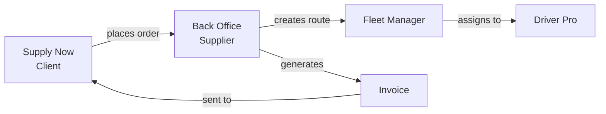

# 2. Supplier — Back Office

**Application:** Back Office
**Platform:** macOS, Web
**Roles:** Admin, Manager

---

## Role Description

The Supplier uses the Back Office application to manage their business operations: product catalog, client orders, pricing, invoicing, delivery scheduling, fleet, and team. The app is designed as a desktop dashboard for daily operational management.

---

## Screens & Features

### Dashboard

Main screen with key metrics and recent activity.

- Orders summary (today, pending, completed)
- Revenue overview
- Recent updates feed (changelog)

### Products

Full product catalog management.

| Function | Description |
|----------|-------------|
| Product list | View all products with filters (active, category, search) |
| Create product | Name, article code, description, images |
| Units | Primary, secondary, tertiary packaging (e.g., piece, box of 12, pallet) |
| Conversion rates | How many base units per packaging unit |
| Weight | Weight per unit (kg) for delivery capacity control |
| Base unit | Reference unit for pricing and conversions |
| PLU codes | Auto-generated codes for weighable items (fractional quantities) |
| Tax rate | Per-product VAT assignment |
| Categories | Hierarchical categories with images |
| Category prices | Price overrides per category |
| Barcodes | EAN-13, QR, UPC/EAN-128, Code39 |
| Activate/Deactivate | Control product visibility in client apps |

### Orders

Order management from clients.

| Function | Description |
|----------|-------------|
| Order list | Filter by status, client, date, delivery zone |
| Order detail | Items, quantities, prices, tax breakdown |
| Status tracking | Multi-step workflow with status history |
| Delivery zone | Auto-assigned based on delivery address |
| Dispatch slot | Assigned departure time and vehicle |
| Weight | Total order weight (auto-calculated) |
| Lock order | Prevent modifications on completed orders |
| Totals | HT (before VAT), tax, TTC (with VAT) |
| Bulk edit | Edit multiple orders simultaneously |

### Invoices

Invoicing and billing.

| Function | Description |
|----------|-------------|
| Invoice list | View all invoices with status |
| Create invoice | Manual creation from completed orders |
| Auto-invoicing | Per-order, daily, weekly, monthly schedules |
| Invoice detail | Line items, totals, bank account details |
| PDF generation | Generate PDF with supplier branding |
| Email sending | Send invoices directly to clients |
| Lock invoice | Finalize to prevent modifications |
| Invoice numbering | Standard or postal-based format |
| Payment terms | Per-client or default payment days |

### Clients

Client relationship management.

| Function | Description |
|----------|-------------|
| Client list | All linked clients with search/filters |
| Client detail | Company info, addresses, contacts |
| Client addresses | Delivery addresses with delivery zone assignment |
| Contacts | Contact persons with roles and phone numbers |
| Multiple phones | Add/edit/delete multiple phone numbers per client (main, mobile, fax, other) with auto-primary and Swiss formatting |
| Multiple emails | Add/edit/delete multiple email addresses per client with labels and auto-primary |
| Contact popup | "+N more" chip in client list shows all phones/emails in a popup dialog with quick actions (copy, call, email) |
| Create client | Register new client company |
| Data import | Import clients from CSV with preview, dry run, and persistent import logs |
| Communication history | Track interactions with client |

### Supplier Settings

Supplier-wide configuration (:material-shield-lock: Admin only).

| Setting | Description |
|---------|-------------|
| Company profile | Name, official name, VAT, fiscal number, logo |
| Addresses | Primary, billing, registered with full address fields |
| Bank accounts | IBAN, BIC, currency for invoicing |
| Main currency | Default currency for all operations |
| VAT mode | Prices include VAT (TTC) or exclude VAT (HT) |
| Default tax | Default VAT rate for new products |
| Lead times | Min lead time (hours), max booking horizon (days) |
| Weight limits | Min order weight, max auto-approved weight |
| Invoicing | Default period, payment terms, numbering format |
| Dispatch settings | Cycle reference date for interval-based scheduling |
| Google Maps keys | API keys for mobile platforms |
| Notification recipient | Default user to receive order notifications |

### Supplier Users

Team management.

| Function | Description |
|----------|-------------|
| User list | All users linked to supplier |
| Roles | Admin (full access), Manager (operational), Courier (delivery) |
| Create user | Add team members with role assignment |

### Delivery Scheduling (via Admin / API)

| Function | Description |
|----------|-------------|
| Operating calendar | Working hours per weekday |
| Exception calendar | Holidays, closed days, modified hours |
| Delivery zones | Geographic areas (cantons, cities, postal codes, GeoJSON) |
| Dispatch slots | Departure times, zones, vehicles, deadlines |
| Cycle types | By weekday (Mon-Fri) or by interval (every N days) |

### Profile

Personal profile management accessible via avatar click on dashboard header.

| Function | Description |
|----------|-------------|
| Avatar | Upload or remove profile picture (S3 storage) |
| Name editing | First and last name with auto-save (1.5s debounce) |
| Email | Read-only display |
| Phone | Read-only display |
| Change password | Dialog with current/new/confirm fields, validation |
| Language | Selector with supported locales (EN, DE, FR, IT) |
| Logout | Confirmation dialog, clears session |

---

## Role Differences

| Feature | Admin | Manager |
|---------|-------|---------|
| View orders, products, clients | Yes | Yes |
| Create/edit products | Yes | Yes |
| Create/edit orders | Yes | Yes |
| Manage invoices | Yes | Yes |
| Edit supplier settings | Yes | No |
| Manage users | Yes | No |
| Block/unblock clients | Yes | No |
| Edit bank accounts | Yes | No |

---

## Data Flow

